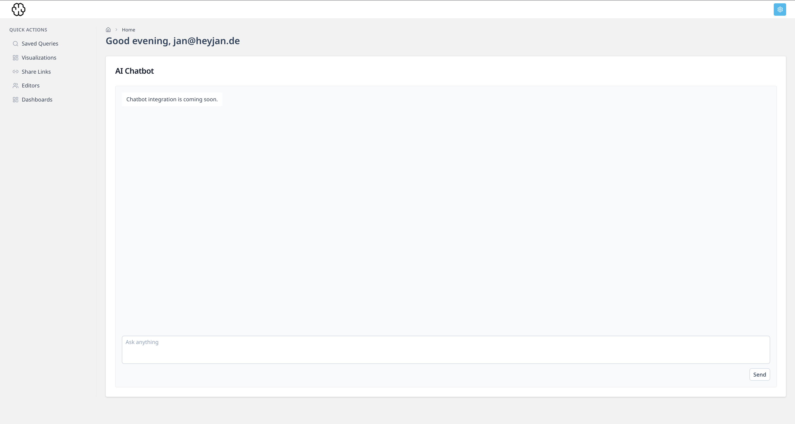

<p align="center">
  
</p>

<h1 align="center">Openbase</h1>

<p align="center">
  <a href="https://nuxt.com/"></a>
  <a href="https://vuejs.org/"></a>
  <a href="https://www.typescriptlang.org/"></a>
  <a href="https://www.postgresql.org/"></a>
  <a href="https://playwright.dev/"></a>
  <a href="https://www.docker.com/"></a>
</p>

Openbase is an open-source analytics and business intelligence platform built for teams that need secure, flexible dashboards across multiple data sources.

It focuses on practical admin workflows: controlled editor permissions, governed write access, shareable dashboards, and production-oriented security defaults.

## Product Preview



## Core Features

- Guided first-run admin setup with magic link and password creation.
- Role-based access control with separate admin and editor sessions.
- Dashboard editor with drag/resize layout and configurable module types.
- Controlled PostgreSQL write workflows via admin-managed writable tables.
- Data-source integrations for PostgreSQL, MySQL, DuckDB, SQLite, and MongoDB.
- Public dashboard sharing through tokenized links.
- PDF export support for shared dashboards.
- Audit logging and security hardening across auth and data-write flows.

Detailed capability breakdown: [Feature Guide](documentation/features.md)

## Architecture

- Frontend: Nuxt 4 + Vue 3 (`app/`)
- Backend APIs: Nuxt server routes (`server/api/**`)
- Database schema: PostgreSQL SQL schema (`db/schema.sql`)
- Static assets: `public/`
- Technical documentation: `documentation/`

## Quick Start (Podman)

```bash
cp .env.example .env
podman compose down
podman compose build
podman compose up
```

Then open `http://localhost:3000` and complete setup.

## Local Development

1. Install dependencies:

```bash
npm install
```

2. Configure environment:

```bash
cp .env.example .env
```

3. Start the dev server:

```bash
npm run dev
```

4. Build for verification:

```bash
npm run build
```

## Testing

End-to-end tests use Playwright:

```bash
npm run test:e2e
```

## Security Notes

- Connection strings and credentials must be provided through environment variables.
- `OPENBASE_ENCRYPTION_KEY` is required in production for encrypted data-source settings.
- Do not commit secrets or production credentials.

## Documentation

- Product specs: `documentation/spec.md`
- Feature guide: `documentation/features.md`
- Security and RBAC planning: `documentation/database-integration-rbac-spec.md`
